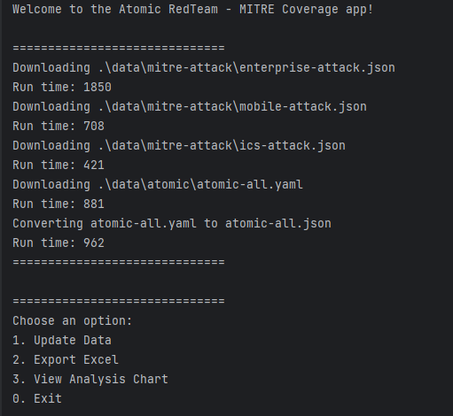
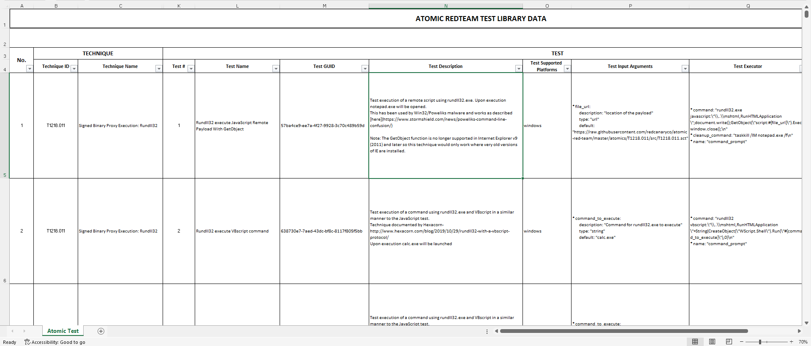
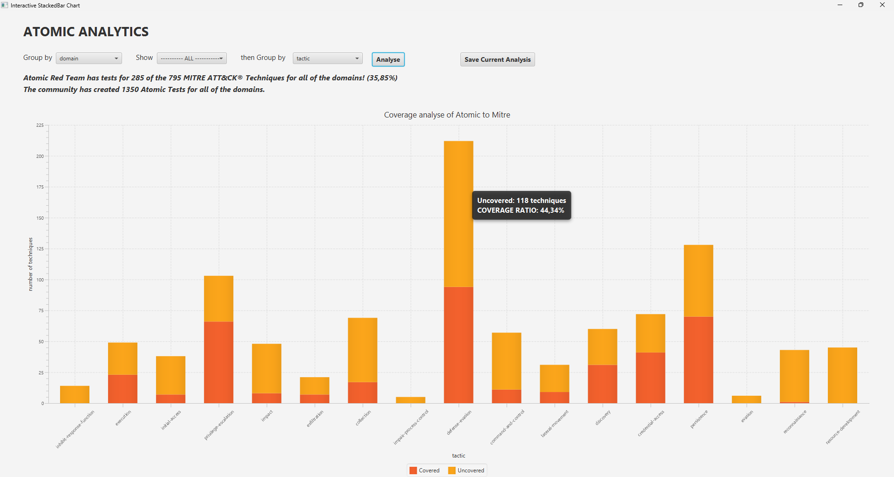

# Atomic RedTeam Threat Intelligence Information Collector

A project for Project 1 course of SoICT - HUST  

## Our team
| Name           |  Student ID | Mail                          |
|----------------|-------------|-------------------------------|
| Chu Minh Ha    | 20210293    | ha.cm210293@sis.hust.edu.vn   |
| Phan Dinh Nhat | 20210654    | nhat.pd210654@sis.hust.edu.vn |

## Project objectives check list

- [x] Allows to collect data about techniques, test cases,... and extract the results as excel files.
- [x] Statistics of coverage according to MITER ATT&CK.

## Usage

Clone this repo and open folder [atomic-redteam-mitre-coverage](./atomic-redteam-mitre-coverage/) in your ide and run the main of [hust.cybersec.App](./atomic-redteam-mitre-coverage/src/main/java/hust/cybersec/App.java). Or you can just download the zip version of [atomic-redteam-mitre-coverage](./atomic-redteam-mitre-coverage/) folder from Releases section.

## Some images
### 1. Main screen

### 2. Exported Excel file

### 3. Chart analysis

